# Italian Restaurant "Bella Caio"

[You can view the website here](https://codewizard-1.github.io/restaurant/index.html)

## Project Goals

The project is designed to attract customers, provide them with a convenient platform to explore the restaurant's menu and services, enable online reservations, and offer a visual delight in the dishes presented.
The name of the restaurant "Bella Ciao" came from the Italian song "Bella ciao." This song is special for Italians, and it inspired our name. Just like the song carries history and feelings, I want the restaurant to convey the same atmosphere and provide our guests with an authentic Italian experience.

## Design

The design of the project is aimed at conveying the atmosphere of Italian culture and taste, providing an easy and convenient experience for everyone. Here are some key features of the design:

**Colors**: We use the colors of the Italian flag: red, white, and green. This makes the website vibrant and warm.

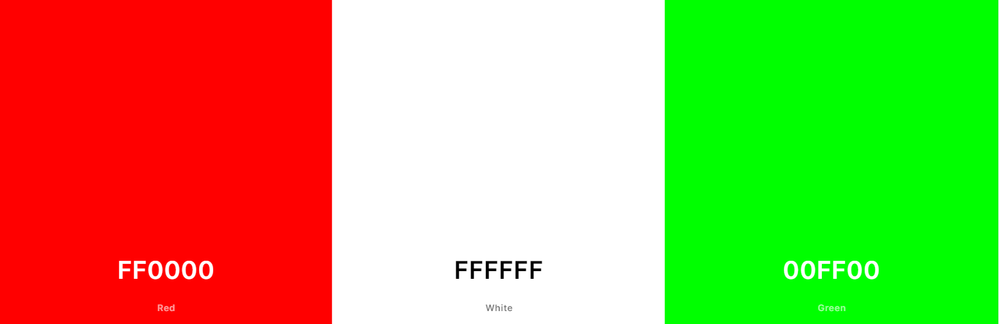

**Logo**: Our logo also incorporates these colors and conveys the restaurant's identity.

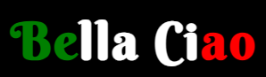

**Text**: Fonts are chosen to make the text clear and beautiful.

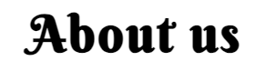

**Layout**: Pages are divided into sections to easily find the necessary information.

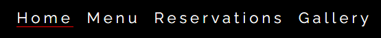

**Images**: We use high-quality photos of dishes and the restaurant interior.

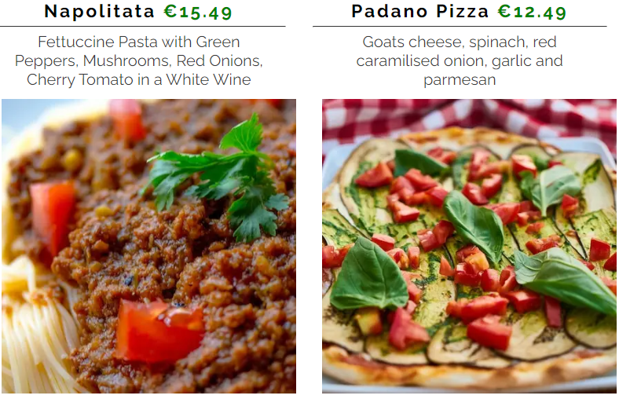

**Table reservation button**:  When you click the reservation button, it turns green and takes you to the "Reservations" page. This button is a simple and fun way for you to book a table at restaurant.

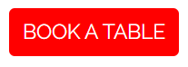
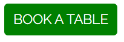

**Mobile-Friendly**: The design looks great on different devices, from computers to phones.
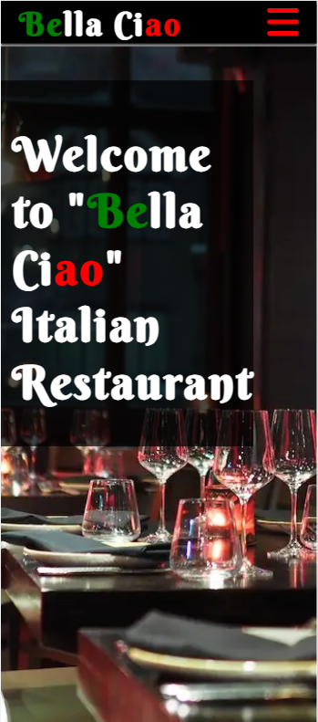
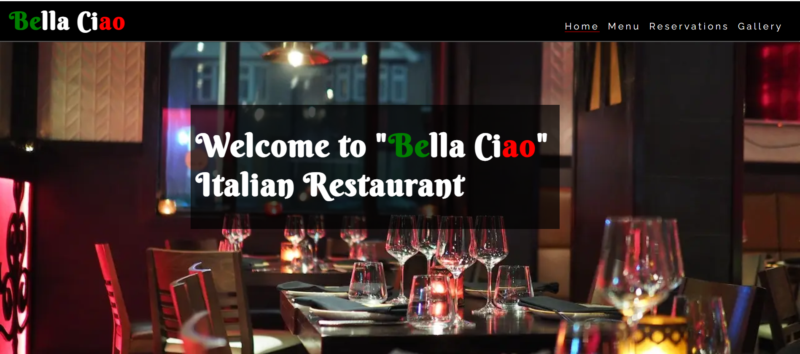

**Convenience**: The design is made so that users easily find the necessary information and can easily get in touch with us.

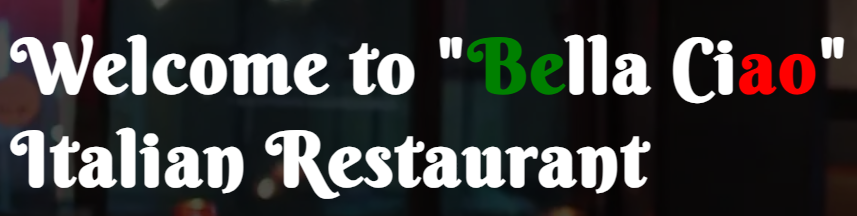

### Languages Used

- HTML5
- CSS3

## Testing
**Mobile device**:

**Destop device**:

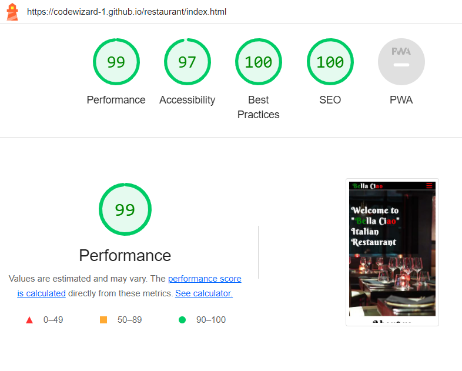

### Frameworks and Programs Used

- Google Fonts - to add and import the fonts used in the website.
- [Fontawesome](https://fontawesome.com) - for the icons used in the website.
- Git - for version control
- GitHub - sharing and storing the files of the website
- [Codeanywhere](https://codeanywhere.com/)  and [Gitpot](https://gitpod.io/) - to code my project
- Lighthouse - to test the accessibility of the website
- [Am I responsive?](https://ui.dev/amiresponsive) To present the website image on a different devices.
- Google Dev Tools - to test features, and responsiveness and to troubleshoot.
- [Favicon-generator](https://favicon.io/favicon-generator/) - to generate a favicon from text for the website.
- [Convertio](https://convertio.co/) and [Cloudconvert](https://cloudconvert.com/) - to convert images type from JPG to WEBP.

### Code

- The code was created inspired by the projects of "Love running" and the website of [this](https://www.ilpomodoro.ie/) restaurant.
- The idea of a button changing color upon clicking was taken from [here](https://dsgnmania.com/)
- 