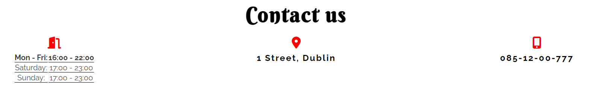

# Italian Restaurant "Bella Caio"

[You can view the website here](https://codewizard-1.github.io/restaurant/index.html)

## Project Goals

The project is designed to attract customers, provide them with a convenient platform to explore the restaurant's menu and services, enable online reservations, and offer a visual delight in the dishes presented.

## Idea
The name of the restaurant "Bella Ciao" comes from the Italian song "Bella ciao". This song is special to Italians and inspired me to name the restaurant. Just as the song carries the story and feelings, I want the restaurant to convey the same atmosphere and give the guests a real Italian atmosphere.

## Design

The design of the project is aimed at conveying the atmosphere of Italian culture and taste, providing an easy and convenient experience for everyone. Here are some key features of the design:

**Colors**: I use the colors of the Italian flag: green, white, and red. This makes the website vibrant and warm.

**Logo**: Logo also incorporates these colors and conveys the restaurant's identity.

**Text**: Fonts are chosen to make the text clear and beautiful.

**Layout**: Pages are divided into sections to easily find the necessary information.

**Images**: I use high-quality photos of dishes and the restaurant interior.

**Table reservation button**:  When you click the reservation button, it turns green and takes you to the "Reservations" page. This button is a simple and fun way for you to book a table at restaurant.

**Mobile-Friendly**: The design looks great on different devices, from computers to phones.

**Convenience**: The design is made so that users easily find the necessary information and can easily get in touch with the restaurant.

### Languages Used

- HTML5
- CSS3

## Accessibility

- During the coding process, I've focused on making the website as user-friendly for accessibility as possible. To achieve this objective.

- I've used semantic HTML elements such as header, section, nav, and footer, providing a clear and meaningful structure to the website, which enhances its accessibility.

- I've added descriptive Alt attributes to images and links. This allows screen readers to explain the content's purpose and context to users with visual impairments.

- I've integrated a hover effect on all buttons to ensure users can easily identify when they're interacting with a button, thus improving the overall user experience.

## Testing

**Validator HTML**:

Checking for errors showed that there are no errors in html

**Validator CSS**:

Checking the css code also showed that there are no errors

**Mobile device**:

**Desktop device**:

### Frameworks and Programs Used

- [Validator HTML](https://validator.w3.org/) and 
 [Validator CSS](igsaw.w3.org) - to check errors in code.
- Google Fonts - to add and import the fonts used in the website.
- [Fontawesome](https://fontawesome.com) - for the icons used in the website.
- Git - for version control
- GitHub - sharing and storing the files of the website
- [Codeanywhere](https://codeanywhere.com/)  and [Gitpot](https://gitpod.io/) - to code my project
- Lighthouse - to test the accessibility of the website
- [Am I responsive?](https://ui.dev/amiresponsive) To present the website image on a different devices.
- Google Dev Tools - to test features, and responsiveness and to troubleshoot.
- [Favicon-generator](https://favicon.io/favicon-generator/) - to generate a favicon from text for the website.
- [Convertio](https://convertio.co/) and [Cloudconvert](https://cloudconvert.com/) - to convert images type from JPG to WEBP.

### Code

- The code was created inspired by the projects of "Love running" and the website of [this](https://www.ilpomodoro.ie/) restaurant.
- The idea of a button changing color upon clicking was taken from [here](https://dsgnmania.com/)

### Features Left to Implement

Given more time, I would have implemented an online food ordering form and  also added a quick scroll-to-top button to the website.
 