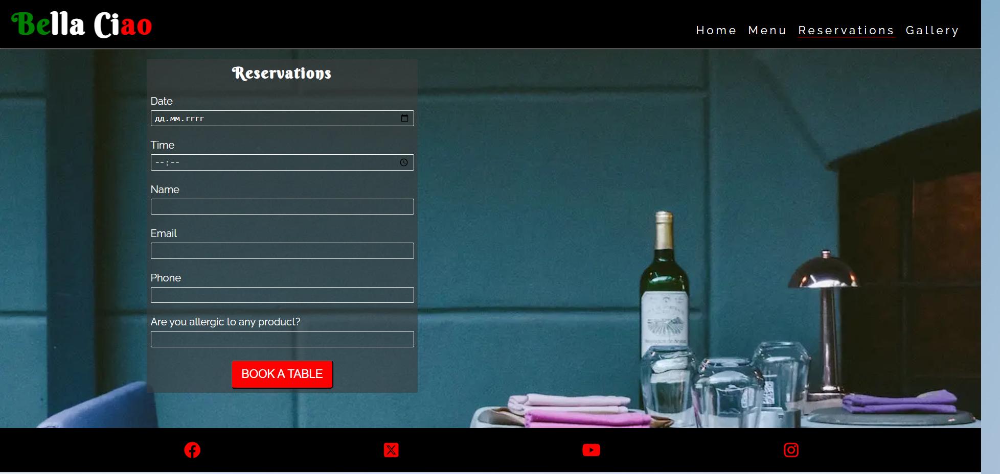

# Italian Restaurant "Bella Caio"

[You can view the website here](https://codewizard-1.github.io/restaurant/index.html)

## Project Goals

The project is designed to attract customers, provide them with a convenient platform to explore the restaurant's menu and services, enable online reservations, and offer a visual delight in the dishes presented.

## Idea
The name of the restaurant "Bella Ciao" comes from the Italian song "Bella ciao". This song is special to Italians and inspired me to name the restaurant. Just as the song carries the story and feelings, I want the restaurant to convey the same atmosphere and give the guests a real Italian atmosphere.

## Design

The design of the project is aimed at conveying the atmosphere of Italian culture and taste, providing an easy and convenient experience for everyone. Here are some key features of the design:

**Colors**: I use the colors of the Italian flag: green, white, and red. This makes the website vibrant and warm.

## Features

The website consists of four pages that are easily accessible from the navigation menu: home page, menu, reservations, gallery. In addition, there is a table reservation button on the home page and on the menu page, which, when clicked, redirects to the order form on the revervations page.
The website has a responsive layout that automatically adjusts when the screen size changes.

**Logo**: Logo also incorporates these colors and conveys the restaurant's identity.

**Text**: Fonts are chosen to make the text clear and beautiful.

**Layout**: Pages are divided into sections to easily find the necessary information.

**Images**: I use high-quality photos of dishes and the restaurant interior.

**Table reservation button**:  When you click the reservation button, it turns green and takes you to the "Reservations" page. This button is a simple and fun way for you to book a table at restaurant.

**Mobile-Friendly**: The design looks great on different devices, from computers to phones.

**Convenience**: The design is made so that users easily find the necessary information and can easily get in touch with the restaurant.

**The Footer**: The footer section includes links to the relevant social media. The links will open to a new tab to allow easy navigation.

**Menu**: The menu includes a list of dishes with a description of the ingredients and the price. As well as an interactive button through which you can book a table.

**Reservations**: The reservations page includes a form, thanks to which you can choose a convenient day and time for booking a table.

**Gallery**: The gallery page presents the dishes and the interior of the restaurant.

### Languages Used

- HTML5
- CSS3

## Accessibility

- During the coding process, I've focused on making the website as user-friendly for accessibility as possible. To achieve this objective.

- I've used semantic HTML elements such as header, section, nav, and footer, providing a clear and meaningful structure to the website, which enhances its accessibility.

- I've added descriptive Alt attributes to images and links. This allows screen readers to explain the content's purpose and context to users with visual impairments.

- I've integrated a hover effect on all buttons to ensure users can easily identify when they're interacting with a button, thus improving the overall user experience.

## Testing

**Manual testing**:
- Link checking:
I alternately clicked on all the internal and external links on the site to make sure they opened and led to the correct pages. All links are working correctly.

- Navigation testing:
I tested how easily users can navigate between different sections and pages of the site using the menu navigation links. I made sure that returning to the main page is available from any page and is intuitive.

- Order Button Check:
I have verified that the table reservation button works correctly and takes me to the reservations page. I also checked that this button changes color and is visually different after being clicked.

- Table booking form testing:
I entered test data into the table reservation form and submitted the form to check that it works correctly. The form is working correctly. I checked the validity of the entered data. Everything works correctly

**Validator HTML**:

Checking for errors showed that there are no errors in html

**Validator CSS**:

Checking the css code also showed that there are no errors

**Mobile device**:

**Desktop device**:

**Fixed bugs**

- Bug 1: Broken Link

Issue: social link "Insatgram" on the footer  were leading to incorrect page.  
Fix: I reviewed and corrected the URL  of the  link, ensuring they point to the intended page

 - Bug 2: Uneven distribution of elements in the section.

Issue:  the elements within the "Contact Us" section were not centered properly, even though I used tools to display items centered.
  
Fix:  I set equal height and width for all elements within the "Contact Us" section. This helped align the elements at the center of the section, creating a more balanced visual effect.

## Frameworks and Programs Used

- [Validator HTML](https://validator.w3.org/) and 
 [Validator CSS](igsaw.w3.org) - to check errors in code.
- Google Fonts - to add and import the fonts used in the website.
- [Fontawesome](https://fontawesome.com) - for the icons used in the website.
- Git - for version control
- GitHub - sharing and storing the files of the website
- [Codeanywhere](https://codeanywhere.com/)  and [Gitpot](https://gitpod.io/) - to code my project
- Lighthouse - to test the accessibility of the website
- [Am I responsive?](https://ui.dev/amiresponsive) To present the website image on a different devices.
- Google Dev Tools - to test features, and responsiveness and to troubleshoot.
- [Favicon-generator](https://favicon.io/favicon-generator/) - to generate a favicon from text for the website.
- [Convertio](https://convertio.co/) and [Cloudconvert](https://cloudconvert.com/) - to convert images type from JPG to WEBP.

## Code

- The code was created inspired by the projects of "Love running" and the website of [this](https://www.ilpomodoro.ie/) restaurant.
- The idea of a button changing color upon clicking was taken from [here](https://dsgnmania.com/)

## Deployment and local development

### Deployment

Github Pages was used to deploy the live website. The instructions to achieve this are below:

- Log in (or sign up) to Github.
- Find the repository for this project, https://github.com/CodeWizard-1/restaurant.
- Click on the Settings link.
- Click on the Pages link in the left hand side navigation bar.
- In the Source section, choose main from the drop down select branch menu. Select Root from the drop down select folder menu.
- Click Save. Your live Github Pages site is now deployed at the URL shown.

### Local Development

How to Clone:

- Log in (or sign up) to GitHub.
- Go to the repository for this project, https://github.com/CodeWizard-1/restaurant.
- Click on the code button, select whether you would like to clone with HTTPS, SSH or GitHub CLI and copy the link shown.
- Open the terminal in your code editor and change the current working directory to the location you want to use for the cloned directory.
- Type 'git clone' into the terminal and then paste the link you copied in step 3. Press enter.

How to Fork:

- Log in (or sign up) to Github.
- Go to the repository for this project, https://github.com/CodeWizard-1/restaurant.
- Click the Fork button in the top right corner.

## Features Left to Implement

Given more time, I would have implemented an online food ordering form and  also added a quick scroll-to-top button to the website.
 